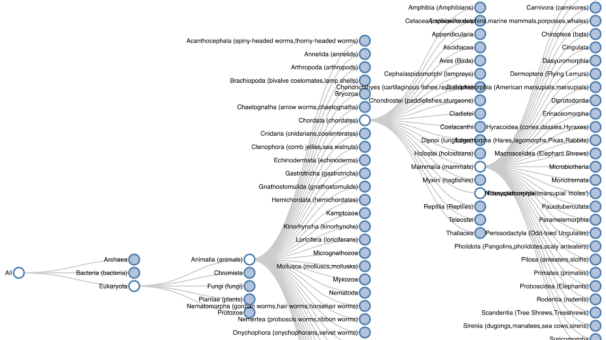
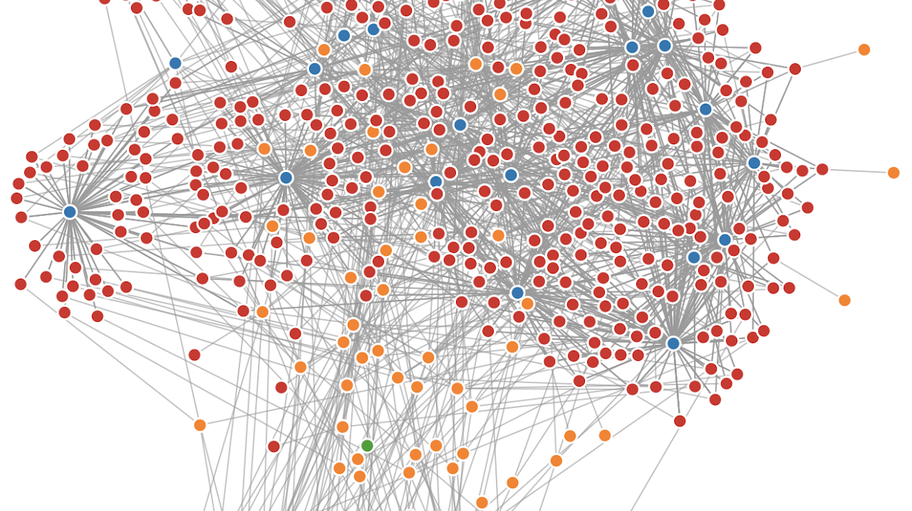

GitHub - [@jwood74](http://github.com/jwood74)

jaxen [@] jaxenwood.com

[Electoral Pendulums](pendulums)

[Maps](https://jaxenwood.com/geographic_boundaries/)

---

## [The Taxonomy of Life](https://adoring-thompson-0173d3.netlify.app)

Ever wanted to see how different animals are related?

Using some data from [ITIS.gov](https://www.google.com/url?q=https%3A%2F%2Fwww.itis.gov%2F&sa=D&sntz=1&usg=AFQjCNEkg_dltu5iepm19RJNNS-g2GkhgQ), and a cool d3 component, I made an interactive component that lets you drill down to all the different species.

---

## [Congress Connections](https://fervent-visvesvaraya-b202c6.netlify.app)

With congress full of 535 members, it can be interesting to see how they are all connected.

Using data from the congress website, and a d3 graph component, I made an interactive tool that shows all 535 members and senators, their home states, and committee memberships.

